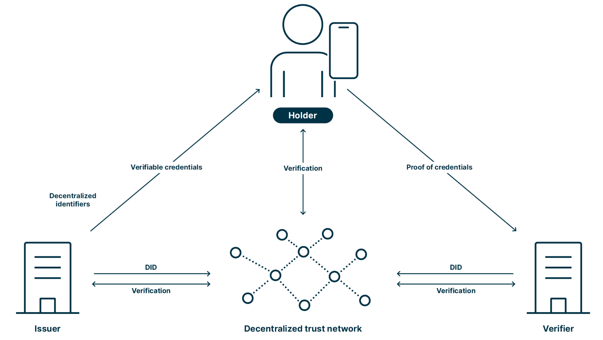

# Self Sovereign Identity
<div align="center">
    
</div>
<div align=center>
	<h3><a href="https://www.youtube.com/watch?v=-RhS38dKmUY">🌐 시연영상</a></h3>
</div>

<br>
<details>
<summary><b> 👩🏻‍💻 프로젝트 멤버</b></summary>

### 졸업 팀

|||
|:-:|:-:|
|<a href="https://github.com/mpqm">👑박종성</a>|<a href="{github}">김민규</a>|

</details>
<br>
<details>
<summary><b> 📌 프로젝트 개요</b></summary>
<br>

  - 디지털 환경에서 개인신원 관리에 대한 기존방식의 대책을 제시
  - 하이퍼레저 페브릭만의 특성을 활용해 개인 정보 보호, 안정성을 강화 및 DID 기술을 적용한 사용자 신원 관리 방법 개발
  - 하이퍼레저 페브릭 기술, DID 핵심 기능 구현을 통한 SSI 모델 기반 3세대 디지털 자기주권 신원인증 플랫폼을 개발
  - SSI 모델은 기존의 중앙화된 신원 인증 방식의 단점을 보완하고, DID 및 VC, VP기술을 활용해 보안성과 프라이버시를 강화

</details>

<br>
 
<details>
<summary><b> 🏃 프로젝트 실행 </b></summary>
<br>

```bash
# Prerequisites: npm, node, MongoDB Connection URL, ubuntu 20, docker, fabric-bin
# ~
sudo apt-get update
sudo apt-get upgrade -y
sudo apt-get install git -y
sudo apt-get install curl -y
# build-essential
sudo apt update
sudo apt install build-essential
#vscode 설치하기
go, docker extension 설치
# docker
sudo apt-get install docker-compose -y
docker --version
docker-compose --version
sudo systemctl start docker
sudo systemctl enable docker
# node.js
# https://github.com/nodesource
# nvm
curl -o- https://raw.githubusercontent.com/nvm-sh/nvm/v0.39.3/install.sh | bash
export NVM_DIR="$([ -z "${XDG_CONFIG_HOME-}" ] && printf %s "${HOME}/.nvm" || printf %s "${XDG_CONFIG_HOME}/nvm")"
[ -s "$NVM_DIR/nvm.sh" ] && \. "$NVM_DIR/nvm.sh" # This loads nvm
nvm -v
sudo reboot
# node.js, npm
nvm install l6
node -v
npm -v
# go
sudo apt remove 'golang-*'
wget https://go.dev/dl/go1.20.5.linux-amd64.tar.gz
tar xf go1.20.5.linux-amd64.tar.gz
sudo mv go /usr/local/go
gedit .profile
# 끝에서 아래 세줄 추가 후 ctrl x로 저장
export GOROOT=/usr/local/go
export GOPATH=$HOME/.go
export PATH=$PATH:$GOROOT/bin:$GOPATH/bin:$GOPATH/src/fabir-samples/bin
source .profile
go version
# jq
sudo apt-get install jq -y
# fabric-samples
# bin 폴더안에 fabric-samples 바이너리 파일 삽입
echo $HOME
mkdir -p $HOME/.go/src
cd $HOME/.go/src/
curl -sSL https://bit.ly/2ysbOFE | bash -s
docker pull hyperledger/fabric-couchdb:latest
# 컨트랙트에서 go.mod, go.sum 자동생성하기
cd {chaincode/path}
go mod init
go mod tidy
GO111MODULE=on go mod vendor
```
```bash
# execution
git clone https://github.com/MpqM/HyperledgerFabric_SSI.git
# hyperledgerfabric
# Change docker-compose, script Msp or address with yours
cd hyperledgerfabric
sudo su
./network.sh start
# backend
cd server
# Change the MONGO_CONNECTION_STRING value in the server/.env file with yours
# Change Hyperledgerfabric Component MSP path value in the server/.env file with yours
npm install
npm start
# frontend
cd client
npm install
npm start
```
</details>

<br>

<details>
<summary><b> 🚀 프로젝트 설명 </b></summary>
<br>

- 하이퍼레저 페브릭 기반 신원 인증 시스템
  - 프라이빗 블록체인 기술을 활용하여 중앙 기관 없이 분산 신원 증명 시스템 구축
  - DID 생성 및 관리 (생성, 수정, 삭제, 조회)
  - VC(검증 가능한 자격 증명) 발급 및 관리
  - VP(검증 가능한 프레젠테이션) 생성 및 검증
  - Node.js 서버를 이용한 하이퍼레저 페브릭과의 연결 및 제어
- DID 기반 신원 인증
  - 사용자가 직접 DID를 생성하여 블록체인 원장에 등록
  - 중앙 기관에 의존하지 않고 사용자가 자신의 신원 데이터를 직접 관리
  - DID 문서를 기반으로 사용자의 신원을 검증하는 Challenge-Response 방식 DID Auth 구현
- VC(검증 가능한 자격증명) 활용
  - 사용자의 대학 졸업 정보 및 신원 정보를 DID 기반으로 VC 발급
  - JSON 형식으로 신뢰성 있는 인증서 발급 및 관리
- VP(검증 가능한 프레젠테이션) 활용
  - 특정 서비스 제공자(검증자)에게 필요한 정보만 선택적으로 제출 가능
  - 블록체인을 활용한 위변조 방지 및 인증 절차 간소화
- Node.js Express 서버 및 API
  - 하이퍼레저 페브릭 네트워크와의 연동
  - REST API를 통해 DID/VC/VP 생성, 검증 기능 제공
  - Fabric Gateway를 활용한 하이퍼레저 페브릭과의 원장 트랜잭션 처리
- React 기반 클라이언트 웹페이지
  - 발급자(Issuer), 보유자(Holder), 검증자(Verifier) 역할별 서비스 페이지 제공
  - 사용자 친화적인 DID 발급, VC 요청 및 관리, VP 제출 및 검증 기능 UI 구현
  - 프론트엔드와 백엔드 간 원활한 데이터 연동을 위한 API 통신
  - 지갑 기능의 데모 버전

</details>

<br>

<details>
<summary><b> 🎮 프로젝트 스택 </b></summary>
<br>

| *CATEGORY*              | **SKILLS**                                                                                                                                                                                                                               | 
|-------------------------|------------------------------------------------------------------------------------------------------------------------------------------------------------------------------------------------------------------------------------------|
| **BACKEND**             |            |
| **FRONTEND**            |                  |
| **DATABASE**            |              |
| **BLOCKCHAIN**          |                                                                                                     |
| **SMARTCONTRACT**       |   |
| **IDENTITY MANAGEMENT** | DID, VC, VP (W3C 표준)                                                                                                                                                                                                                     |
| **AUTHENTICATION**      | DID Auth (Challenge-Response)                                                                                                                                                                                                            |
| **NETWORKING**          | gRPC, Fabric Gateway                                                                                                                                                                                                                     |
</details>

<br>

<details>
<summary><b> 📃 프로젝트 문서 </b></summary>
<br>

| **프로젝트 문서**   |**링크**|
|---------------|--------|
| 🎡 시스템 아키텍처    | [시스템 아키텍처](https://github.com/mpqm/express-service-ssi/tree/main/meta/media/image2.png)|
| 📃 학사 졸업 논문     | [학사 졸업 논문](https://github.com/mpqm/express-service-ssi/blob/main/meta/doc/%ED%95%99%EC%82%AC%EC%A1%B8%EC%97%85%EB%85%BC%EB%AC%B8.pdf)|
| 🎥 프로젝트 시연 영상 | [프로젝트 시연 영상]((https://github.com/mpqm/express-service-ssi/tree/main/meta/media/image2.png))|

</details>

<br>


